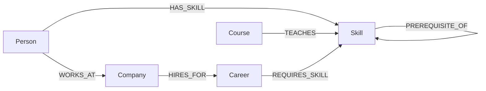

# Career Compass

A graph-native route planner from the skills someone has to the career they want — built on **CognoDB** (openCypher over Bolt).

Career Compass models people, skills, courses, careers and companies as a connected graph, then answers questions that are naturally about *paths and neighborhoods*: "what's the shortest chain of prerequisites to my next skill?", "who's already ahead of me on this route?", "what does this career actually require, and how do those requirements connect to each other?"

#### 🔗 Live Demo: [career-compass-pfj8.onrender.com](https://career-compass-pfj8.onrender.com/)
*(Free-tier hosting — the first request may take 30–60 seconds to wake the server up.)*

---

## Why a graph database?

The whole point of Career Compass is **paths and connections**, not rows:

- **Skill prerequisite chains are recursive by nature.** "What can I learn next, given what I already know, up to 3 steps away?" is a variable-length traversal (`PREREQUISITE_OF*1..3`). In a relational schema this needs a recursive CTE that self-joins an edge table N times and manually de-duplicates cycles — doable, but it fights the schema. In Cypher it's one pattern.
- **"People like me" is a graph-shaped query.** Finding peers who share the most skills, then surfacing *what they know that I don't*, is a two-hop pattern (`(me)-[:HAS_SKILL]->(:Skill)<-[:HAS_SKILL]-(peer)`) followed by a second fan-out. In SQL this is a self-join on a bridge table, grouped and re-joined again — the query plan and the schema both get harder to read as more relationship types get added.
- **The domain keeps growing new relationship types**, not new tables: `REQUIRES_SKILL`, `TEACHES`, `PREREQUISITE_OF`, `WORKS_AT`, `HIRES_FOR`. Each is a first-class, independently-queryable edge with its own properties (e.g. `importance` on `REQUIRES_SKILL`, `level` on `HAS_SKILL`). Modeling this relationally means either a wide junction table with a `type` discriminator column (which then needs filtering everywhere) or a proliferating set of many-to-many tables — both add friction a graph doesn't have.
- **Traversal depth is a variable, not a schema decision.** Whether "nearby" means 1 hop or 3 hops is a query-time parameter (`*1..3`) here. In SQL, changing that means changing how many times you self-join.

None of this is *impossible* in Postgres — it's that the natural shape of the questions ("what's reachable from here", "who's structurally similar to me") maps directly onto graph primitives (paths, neighborhoods, variable-length traversal) instead of needing to be reconstructed out of tables and joins.

---

## Data model

**Nodes**

| Label | Key properties |
|---|---|
| `Person` | `id`, `name`, `currentRole` |
| `Skill` | `id`, `name`, `category` |
| `Course` | `id`, `name`, `provider`, `hours` |
| `Career` | `id`, `name`, `level` |
| `Company` | `id`, `name`, `industry` |

**Relationships**

| Relationship | Direction | Properties | Meaning |
|---|---|---|---|
| `(:Person)-[:HAS_SKILL]->(:Skill)` | Person → Skill | `level` | A person's current skills |
| `(:Skill)-[:PREREQUISITE_OF]->(:Skill)` | Skill → Skill | — | Learning order between skills |
| `(:Course)-[:TEACHES]->(:Skill)` | Course → Skill | — | What a course teaches |
| `(:Career)-[:REQUIRES_SKILL]->(:Skill)` | Career → Skill | `importance` (`core` / `nice-to-have`) | What a career needs |
| `(:Company)-[:HIRES_FOR]->(:Career)` | Company → Career | — | Which companies hire for which roles |
| `(:Person)-[:WORKS_AT]->(:Company)` | Person → Company | — | Current employer |



Seed data (`src/data/seedData.js`): 24 skills, 15 courses, 7 careers, 5 companies, 8 people, and ~90 relationships — enough to make traversals and peer comparisons meaningful while staying well inside the CognoDB free-tier (c0) sizing guidance.

---

## The main queries

All queries live in `src/routes/api.js` and run through the official Neo4j driver with **parameterized Cypher** — no string concatenation anywhere.

### 1. Skill gap analysis (`GET /api/careers/:careerId/gap?personId=...`)
For a chosen career and person: which required skills they already have, which are missing, and which courses teach the missing ones. Chains `REQUIRES_SKILL` and `TEACHES` around a shared `Skill` node and aggregates a nested collection per row.

### 2. What's reachable next — the multi-hop traversal (`GET /api/people/:personId/unlockable-skills`)
```cypher
MATCH (p:Person {id: $personId})-[:HAS_SKILL]->(known:Skill)
WITH p, collect(DISTINCT known) AS knownNodes, collect(DISTINCT known.id) AS knownIds
UNWIND knownNodes AS k
MATCH path = (k)-[:PREREQUISITE_OF*1..3]->(target:Skill)
WHERE NOT target.id IN knownIds
WITH target, k, length(path) AS hops
RETURN target.id AS skillId, target.name AS skillName, target.category AS category,
       min(hops) AS hopsAway, collect(DISTINCT k.name)[0..3] AS unlockedBy
ORDER BY hopsAway ASC, skillName ASC LIMIT 12
```
A genuine variable-length traversal (1–3 hops) — the query the assignment asks for. The relational equivalent needs a recursive CTE. Exclusion of already-known skills is done via explicit id-list membership (`collect` + `IN`) rather than a `WHERE NOT (p)-[:HAS_SKILL]->(target)` pattern predicate — see the CognoDB compatibility note below.

### 3. Peer recommendation (`GET /api/people/:personId/peers`)
Finds people who share the most skills with a given person, then surfaces skills those peers have that the person doesn't — collaborative filtering as a graph pattern, awkward as a multi-way self-join in SQL. Uses the same id-list exclusion technique as query 2, for the same reason.

### 4. Career skill map (`GET /api/careers/:careerId/graph`)
Returns the required-skill subgraph for a career plus prerequisite edges *between* those required skills, for the visual explorer on the page.

### 5. Graph stats (`GET /api/stats`)
Total counts of every node and relationship type — powers the "24 skills · 7 careers · ..." line under the hero, so the page shows the graph has real weight before you even pick a traveler.

---

## CognoDB compatibility note

CognoDB does not evaluate negated relationship-pattern predicates inside `WHERE` the same way Neo4j does — a clause like `WHERE NOT (p)-[:HAS_SKILL]->(target)` excluded every row instead of just the ones matching the pattern (verified with `src/diagnose-unlockable.js`). Fixed by rewriting exclusion as explicit id-list membership (`collect(...) AS knownIds` + `WHERE NOT target.id IN knownIds`) instead of a pattern predicate. Both `unlockable-skills` and `peers` use this form.

---

## Project structure

```
career-compass/
├── server.js              # Express entry point
├── src/
│   ├── db.js               # Driver setup, connection verification, graceful errors
│   ├── seed.js              # Loads seed data via parameterized Cypher
│   ├── diagnose-unlockable.js  # Standalone diagnostic for the multi-hop query (dev tool, not part of the app)
│   ├── data/seedData.js      # All seed nodes & relationships
│   └── routes/api.js         # REST endpoints + the Cypher queries above
├── public/
│   ├── index.html
│   ├── styles.css           # Trail-map visual system, category color palette
│   └── app.js               # Fetches from the API, renders the UI, draws the SVG map
├── .env.example
└── package.json
```

---

## Setup & run

### 1. Create your CognoDB instance
1. Sign up at [console.cognodb.com/signup](https://console.cognodb.com/signup) (no credit card needed for the free tier).
2. Create a free **c0** instance and pick a region — provisions in under a minute.
3. Copy the connection URI (`bolt+s://<instance-id>.databases.cognodb.cloud`) and the generated password for user `cognodb`. **The password is shown once — save it now.**

### 2. Configure the app
```bash
cp .env.example .env
```
Edit `.env`:
```
COGNODB_URI=bolt+s://<instance-id>.databases.cognodb.cloud
COGNODB_USER=cognodb
COGNODB_PASSWORD=<your generated password>
PORT=3000
```
`.env` is git-ignored — nothing here gets committed.

### 3. Install, seed, run
```bash
npm install
npm run seed     # loads the graph into CognoDB — prints node/relationship counts when done
npm start        # http://localhost:3000
```
If CognoDB is unreachable (wrong credentials, instance paused, network issue), the server still boots — the UI shows a clear "can't reach the database" banner instead of crashing, and `/api/health` reports the specific error.

### 4. Try it
Open `http://localhost:3000`, pick a traveler and a destination career, and Career Compass will:
- show a readiness score and which required skills are matched vs. missing (with course recommendations for the gaps)
- surface skills within 1–3 prerequisite hops of what the person already knows
- show peers with overlapping skills and what they know that this person doesn't
- render a map of the destination career's required skills and how they connect

---

## Deployment

Live at **[career-compass-pfj8.onrender.com](https://career-compass-pfj8.onrender.com/)**, deployed as a Render free web service:
1. Repo connected directly from GitHub.
2. Build command: `npm install`. Start command: `npm start`.
3. Environment variables `COGNODB_URI`, `COGNODB_USER`, `COGNODB_PASSWORD` set in Render's dashboard — never committed to the repo.

To deploy your own copy: push this repo to GitHub, create a free Web Service on [render.com](https://render.com) (or [railway.app](https://railway.app), same steps) pointing at it, set those three environment variables, and deploy.

---

## Screenshots


## Screen recording

[Watch the walkthrough](https://drive.google.com/file/d/1bi6j3LedfF5t6QzB0gJ1etiJRblX7-Cs/view?usp=sharing)

---

## Engineering notes

- **No string-concatenated Cypher anywhere** — every query uses `$parameters` bound through the driver.
- **Connection details** are read exclusively from environment variables (`src/db.js`); `.env` is git-ignored.
- **Graceful failure**: if CognoDB is unreachable, `verifyConnection()` catches it at boot and on every request, and the API returns `503` with a plain-language message instead of a stack trace; the frontend shows a banner instead of a blank page.
- **Sessions are always closed** (`finally` block in `runQuery`), which matters on a free tier capped at 200 connections.
- **Worked around a CognoDB-specific query limitation** — see the compatibility note above.
